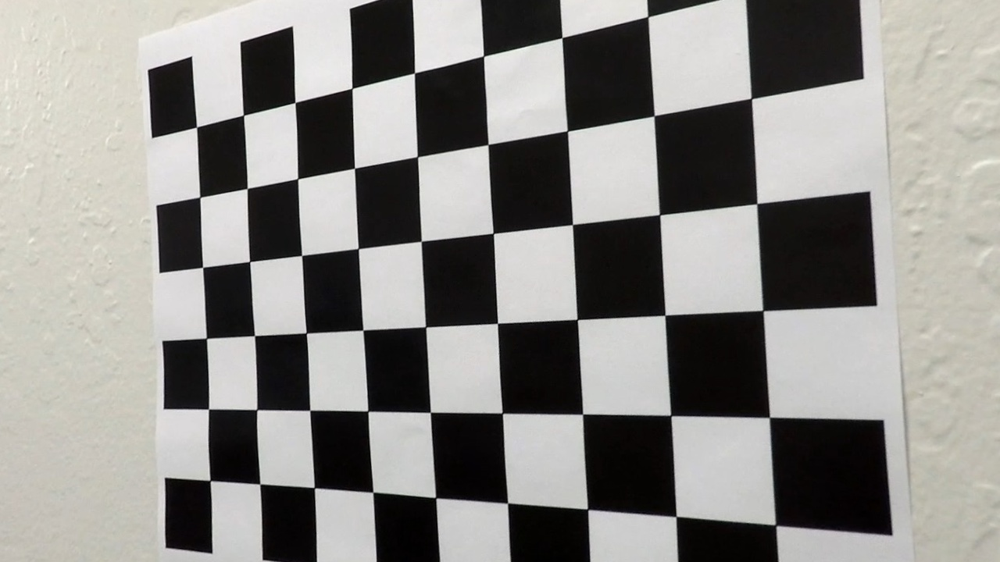
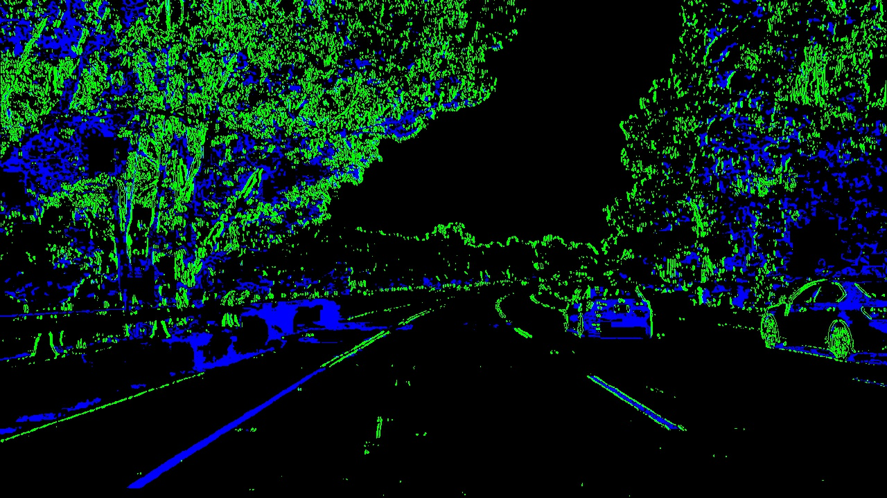
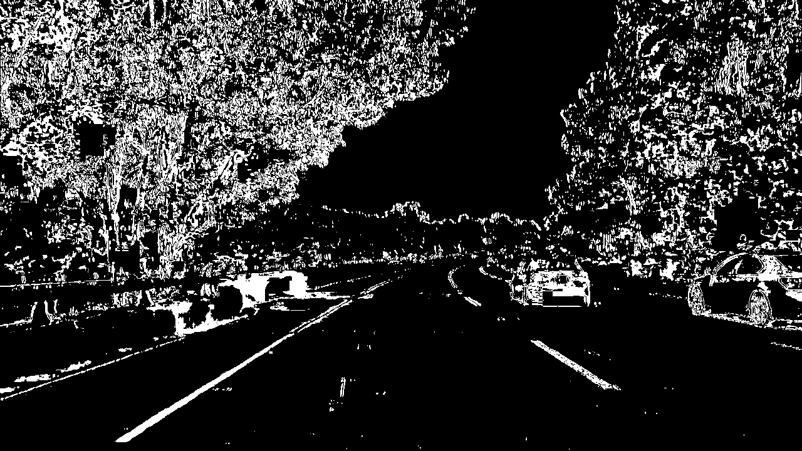
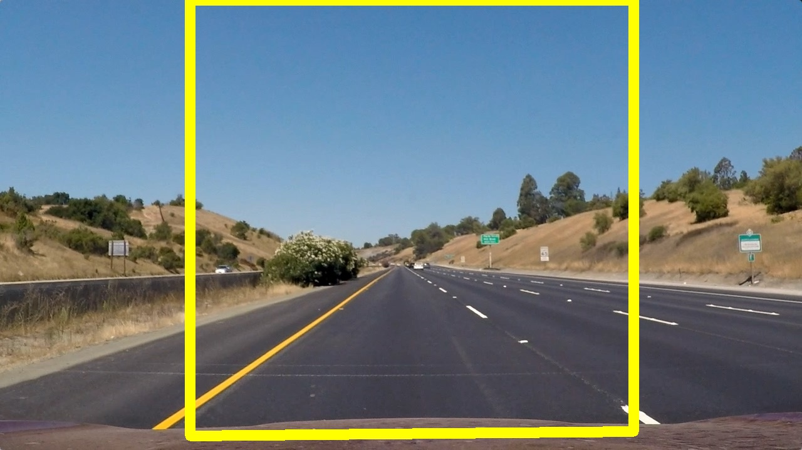
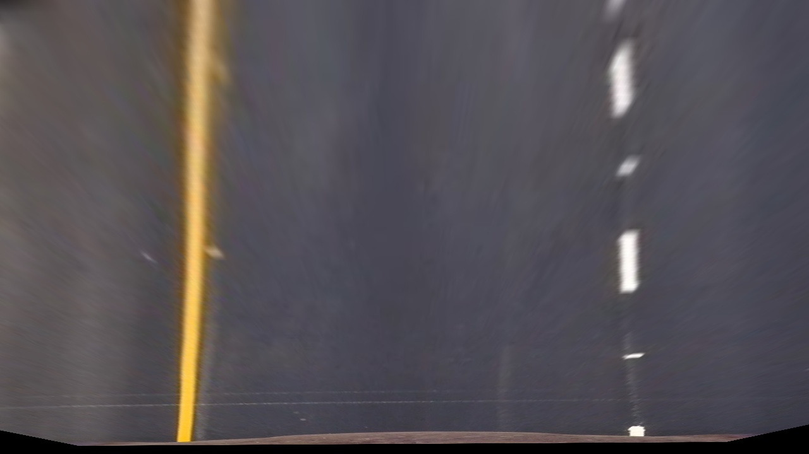
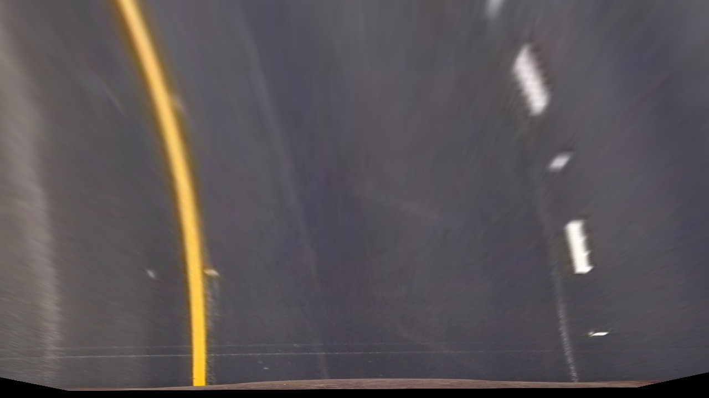
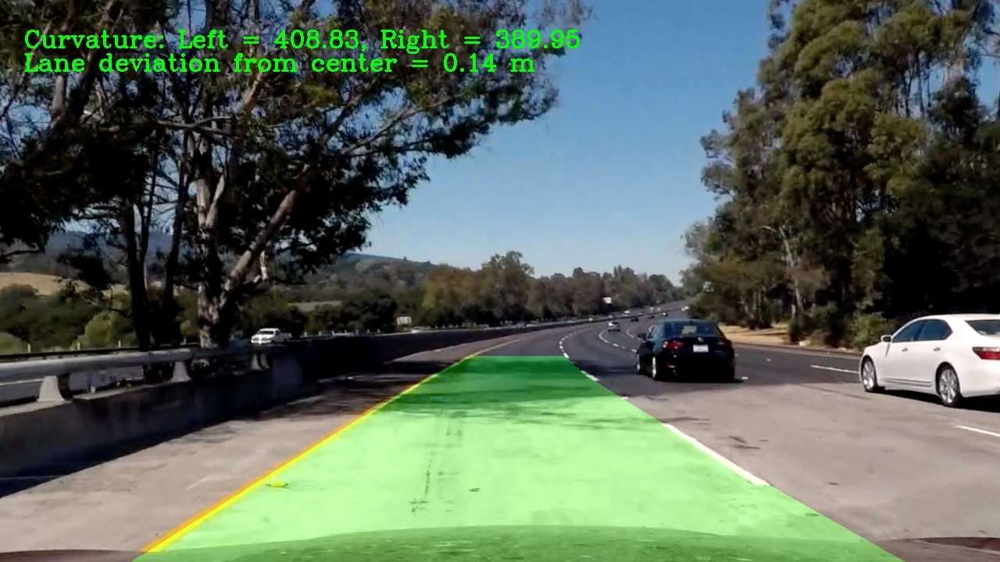
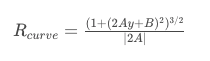

## Advanced Lane Finding 

The goals / steps of this project are the following:

* Compute the camera calibration matrix and distortion coefficients given a set of chessboard images.
* Apply a distortion correction to raw images.
* Use color transforms, gradients, etc., to create a thresholded binary image.
* Apply a perspective transform to rectify binary image ("birds-eye view").
* Detect lane pixels and fit to find the lane boundary.
* Determine the curvature of the lane and vehicle position with respect to center.
* Warp the detected lane boundaries back onto the original image.
* Output visual display of the lane boundaries and numerical estimation of lane curvature and vehicle position.

Output of lane finding pipeline on sample video:

---
### Camera Calibration
With a set of camera calibration images (chessboards) in the camera_cal folder I am able to calculate the camera distortion parameters and use these to un-distort our images.

First of all I need to detect the inner-corners of the calibration images. This can be seen in  jupyter notebook: `2. Advanced Lane Line Detection.ipynb`. In these cells I display the given chessboard calibration images, calculate the object and image points (as discussed below), then display a sample of the found chessboard corners in one image.
The object and image points are saved in arrays: `objpoints` and `imgpoints`.

In finding the corners I also prepare an "object points" array, which will be the (x, y, z) coordinates of the chessboard corners in the world. Here I'm assuming the chessboard is fixed on the (x, y) plane at z=0, such that the object points are the same for each calibration image.  Thus, `objp` is just a replicated array of coordinates, and `objpoints` will be appended with a copy of it every time I successfully detect all chessboard corners in a test image.  `imgpoints` will be appended with the (x, y) pixel position of each of the corners in the image plane with each successful chessboard detection.  

I then used the output `objpoints` and `imgpoints` to compute the camera calibration and distortion coefficients using the `cv2.calibrateCamera()` function. I applied this distortion correction to the test image using the `cv2.undistort()` function and obtained this result:

Before                     |  After
:-------------------------:|:-------------------------:
  |  

This code is in cell 5 of the notebook: `undistort_image()`

### Pipeline (single images)

#### Camera distortion correction
Below is an example of a before and after distortion-corrected test image. Note the repositioning of the white car which is actually further back once camera distortion is correct for...
See cell 8 of the notebook for the code how I accomplished this. Its simply a matter of running the camera calibration using the already computed object and image points and then passing these to `cv2.undistort()`.

(One point to be careful of is that OpenCV reads and write images in BGR format. I use `cv2.cvtColor()` to switch to RGB and back again.)

Before                     | After
:-------------------------:|:-------------------------:
 |  

I've wrapped the camera undistort code into the function `undistort_image()` for later use. This is in notebook cell 5.

#### Colour thresholding and Gradients
I used a combination of color and gradient thresholds to generate a binary image (thresholding steps are in function `threshold_binary()` in notebook cell 11.

Firstly I convert the image to the HSV colour space and grab the S-channel only - samples of which show that it enables us to see the lane lines regardless of the colours better. I then threshold this image between pixel intensities 170 and 255.

Additionally we use the OpenCV Sobel function to take the gradient of the image in the X direction. By taking the gradient in the X direction we can better pick out vertical features in the image (such as lane lines). The gradient is then thresholded as well between 20 and 100.

Finally we merge these two thresholded images. At the bottom of the `threshold_binary()` function in cell 11 you can see that we form two images. One is for debugging purposes where we stack the two images on top of each other (`color_binary`) - enabling us to see in one image how each technique is contributing. The other (`combined_binary`) is simply a bitwise-or between the two images

Here's an example of my output for this step showing both the images described above.

Colorized debug image      | Our combined thresholded binary image
:-------------------------:|:-------------------------:
 |  

I used the combined thresholded binary image above on the right to find the lane lines.

#### Birds-eye-view - perspective transformation.
To find lane lines and their curvature first of all we can perform a perspective transformation on the image to get a top-down or birds-eye-view of the road.

The code for my perspective transformation is in notebook cells 6, 9 and 10. It starts with a function called `warp_image()` which uses the OpenCV `getPerspectiveTransform()` and `warpPerspective()` to execute the actual perspective transform. The perspective transform is based on a set of source and destination images points.

In cell 9 I have manually derived some good source and destination points so that our resulting transformed images have "close-to" parallel lines.

Here is a visualisation of my chosen source and destination points:

| Source points                     | Destination points        |
|:---------------------------------:|:-------------------------:|
|  |  |

I have aimed for the source points to make out a trapezoidal shape just large enough to contain the lane lines (with a margin for road width changes) and reaching into the distance just over approx. 1/3 the way up the image.

For the destination points I have fixed them as a rectangle, roughly the width of the lane lines.

Here is some examples of warped test images:

| Straight section of road                    | Curved section of road             |
|:-------------------------------------------:|:----------------------------------:|
|  |  |

#### Finding the lane lines
With our binary warped image above I then searched for the lane lines as follows:
- Find initial lane lines using a histogram along the bottom half of the image
- Use a sliding window to iteratively move up the image finding the lane lines till we hit the top
- Fit a 2nd order polynomial to the found lane line pixels

Histogram along the bottom of thhe above binary warped image:

Notebook  shows the `draw_lanes_on_image()` function which I used to highlight the road lane lines with a filled polygon (`cv2.fillPoly()`). This function then un-warps the image (using the inverse perspective transform parameters saved earlier - Minv) to show the completed result (as above).

The completed pipeline can be clearly seen in function `process_image()`. Then we execute this for one sample image.

#### Radius of curvature of the lane and the position of the vehicle with respect to center.

The radius of curvature for each line and the position of the vehicle within the lane lines is calculated in function `get_curvature()` in cell 14. This function is called within my lane finding code (`find_lane_lines()`)

Processing:
- Convert from pixels to metre's
- Fit polynomials to the left and right lane line points again (this time in real-world space instead of pixel-space)
- Calculate the curvature as per the equation for radius from a 2nd order polynomial below (as a radius in metres)
- Calculate the lane deviation from the center (between lane lines and assuming the camera is in the center of the car) - again in real-world space.

Example image showing
---

### Pipeline (video)

Here is a link to a processed video thats been run through my pipeline (described above). Results on the project video are very good given the little amount of parameter tuning that has been done. There is a slight jitter when the car travels over the differently coloured concrete sections of road, but it is very minor.

[Link to my video result](https://www.youtube.com/watch?v=DO40OF0l2x8)

---

### Discussion
The results with very limited tuning of the image thresholding and no smoothing between frames or error handling are impressive on the test video.
However it all falls apart on the challenge videos largely because of the different road surfaces and vertical lines in the surface.

To improve the performance on the challenge video we could perform some of the following operations in the pipeline:
- Error handling : Check the mean squared error between subsequent polynomial fits. If the error is greater than a determined threshold then drop the frame (not the frame itself but the lane line finding result). This would stop the polynomial from changing too much between frames and could stop the issues encountered on the challenge video where their is a vertical seem up the middle of the road that is wrongly detected as a lane line.
- Result smoothing. Use a weighted average or smoothing such as a first order filter response, i.e. coeffs = 0.95*coeff~prev+ 0.05 coeff.
- Colour spaces. Investigate other colour space and their channels to see which still shows the lanes the best over the concrete sections of road.
- Performance. My processing pipeline is quite slow. This could be greatly improved by using the code in notebook cells 17 and 18 on all but the first video frame to save having to use the full sliding window search.

I can see that for every different road surface or driving condition we would have to further tune the image thresholding and so on, which I think is a major limitation of this computer vision technique.
So long as we could accumulate enough driving data I'd be much more inclined to use a deep convolutional network and let it train and find the lanes...

Finally... I do wonder how we would get a self-driving car to "change lanes"..?
